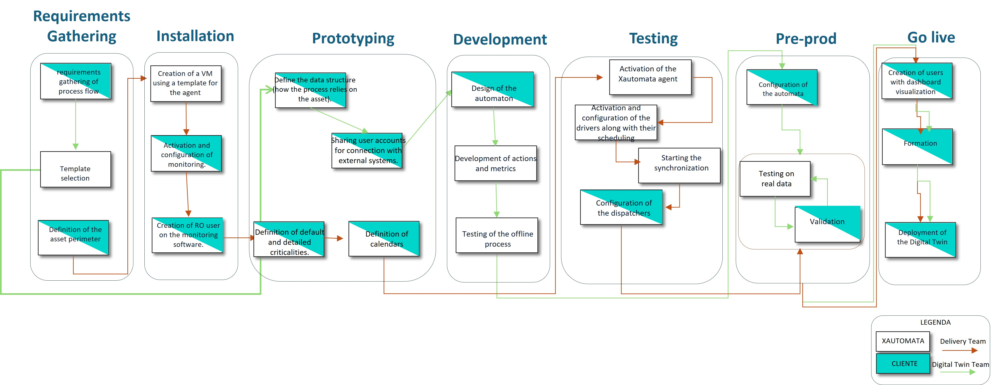
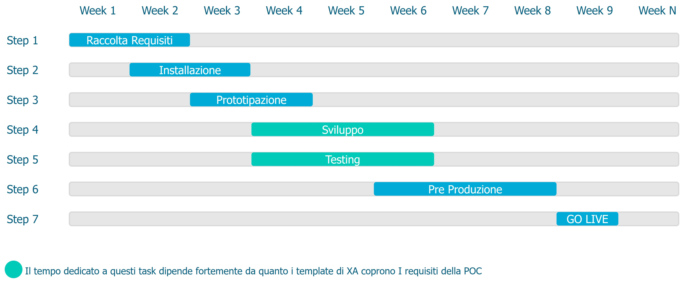

# Automation Pilot Program

An Automation Pilot Program (APP) represents the implementation process of a project with XAUTOMATA.

An APP requires a series of standard activities that ensure a fast and efficient implementation.

## The activities

## The roadmap

